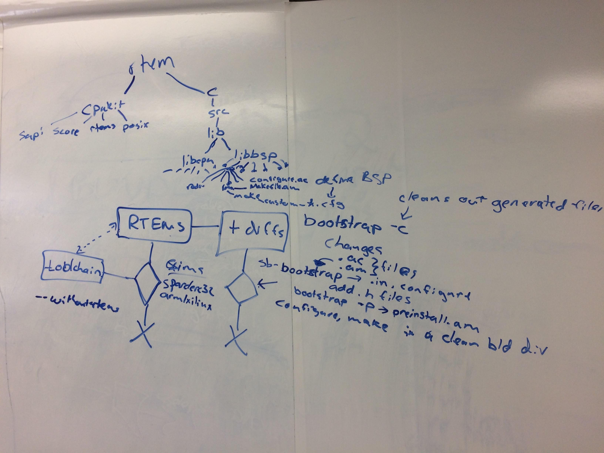

# RTEMS
Everything done here is done in a x86_64 GNU/Linux 4.12.8-2-ARCH machine

## Table of Content
- [Configuring the development environment](Topics/config_dev_env)
- [Setting up RTEMS in SPARC](Topics/set_rtems_for_sparc)
- [Setting up RTEMS in ARM](Topics/set_rtems_for_arm)

Documentation for the steps taken while building RTEMS in my x86 computer for TI's TM4C arm architecture 

## Diagram of how rtems is organized


## Theory
RTEMS Source Builder (RSB): 
- is a tool to aid building packages from source used by the RTEMS project.
- Has two types of configuration data
    - A build set:
        -  A build set describes a collection of packages that define a set of
           tools you would use when developing software for RTEMS. For example
           the basic GNU tool set is binutils, gcc, and gdb and is the typical
           base suite of tools you need for an embedded cross-development type
           project. 
    - Configuration Files:
        - They define how a package is built.
        - They are scripts that: 
            - Prepare
            - Build
            - Install
            packages

RSB installs into a build *prefix*.
Prefix: 
    - the top of a group of directories containing all the files needed to develop RTEMS applications. 


### Create a sandbox environment
```
$ cd
$ mkdir -p development/rtems
$ cd development/rtems
```

### Get the rsb, a builder for toolchains, toolchains is required for rtems architecture as shown in the RTEMS Organization diagram above
```
$ git clone git://git.rtems.org/rtems-source-builder.git rsb
```

### Check if your computer can support building the toolchain
```
$ cd rsb
$ ./source-builder/sb-check
```
Continue only if your output is similar to:
```
RTEMS Source Builder - Check, 4.12 (4c5eb8969451)
Environment is ok
```
### Build toolchains for arm and sparc architectures as well as compile toolchain to get qemu
```
$ cd rtems
$ ../source-builder/sb-set-builder --prefix=$HOME/development/RTEMS/rtems/4.12 4.12/rtems-sparc
$ ../source-builder/sb-set-builder --prefix=$HOME/development/RTEMS/rtems/4.12 4.12/rtems-arm
$ ../source-builder/sb-set-builder --prefix=$HOME/development/RTEMS/rtems/4.12 --without-rtems devel/qemu
```
## Now, compiling a bsp, an arm tm4c129e in this case

### Set up the path
```
export PATH=$HOME/development/rtems/4.12/bin:$PATH #Or add to your PATH variable.
```
### Download the rtems OS in the required director
```
cd
cd development/rtems
mkdir kernel
cd kernel
git clone git://git.rtems.org/rtems.git rtems
```
### Convert all the .ac and .am files we have from the just downloaded rtems kernel 
```
cd rtems
./bootstrap -c && ./bootstrap -p && $HOME/development/rtems/rsb/source-builder/sb-bootstrap
```
bootstrap -c is for cleaning all the remaining make and config files
bootstrap -p is for doing smt with the preinstalled things
and we use the sb-bootstrap from the previously received rsb for building the make and config files from .ac and .am files

### Build the bsp
```
cd ..
# build the sparc/erc32 machine
# create a directory to keep the bsp for sparc/erc32
mkdir erc32
cd erc32
$HOME/development/rtems/kernel/rtems/configure --prefix=$HOME/development/RTEMS/rtems/4.12 --target=sparc-rtems4.12 --enable-rtemsbsp=erc32 --enable-posix

# build the arm/b_realview_arm
cd ..
# create a directory to keep the bsp for arm/realview_pbx_a9_qemu
mkdir b-realview_pbx_a9_qemu
cd b-realview_pbx_a9_qemu

# Compile the realview-pbx-arm machine's kernel files
$HOME/development/rtems/kernel/rtems/configure --target=arm-rtems4.12 --disable-networking --enable-rtemsbsp=realview_pbx_a9_qemu --enable-posix --prefix=$HOME/development/RTEMS/rtems/4.12
```
We need these to confirm that nothing is wrong with the rtmes or toolchain in case we have errors for tm4c129e

# Moving on to compiling bsp for tm4c129e
What I have done so far:

### Create a new directory and get Habeebs code that claims to have built a bsp for TM4C129E board
```
cd ~/development/
git clone https://github.com/Dipupo/rtems.git haheeb-rtems
```

### Create the patch files of the commits that habeeb implemented
```
cd ~/development/habeeb-rtems
git format-patch b30ab25 --stdout > ~/development/rtems/kernel/rtems/habeeb_diff.diff
```
### apply the patch files created
```
cd ~/development/rtems/kernel/rtems
git apply --reject habeeb_diff.diff
```

In my case, I got two .rej files. On inspection, I only needed to delete them because they were implemented, probably in another commit as well.

### compile the bsp
```
cd ~/development/rtems/kernel
cd rtems
./bootstrap -c && ./bootstrap -p && $HOME/development/rtems/rsb/source-builder/sb-bootstrap

cd ..
mkdir tm4c129e
cd tm4c129e
$HOME/development/rtems/kernel/rtems/configure --target=arm-rtems4.12 --disable-networking --enable-rtemsbsp=tm4c129e --enable-posix --prefix=$HOME/development/RTEMS/rtems/4.12

make all
make install
```
Here, ```make all``` gives the error as mentioned in [Error file](https://github.com/sammanthp007/build-rtems-documentation/blob/master/make%20error%20tm4c129e)
